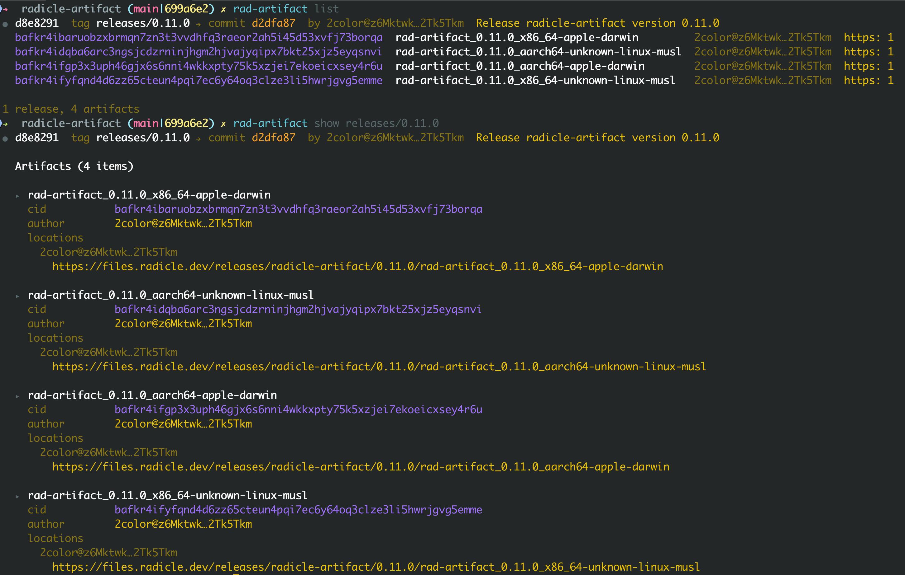
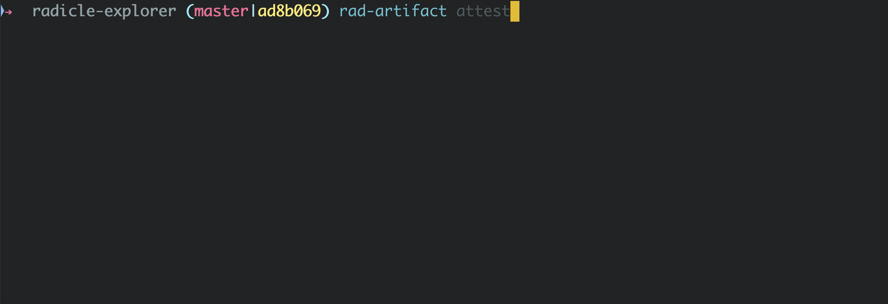

# Changelog

All notable changes to this project will be documented in this file.

The format is based on [Keep a Changelog](https://keepachangelog.com/en/1.1.0/),
and this project adheres to [Semantic Versioning](https://semver.org/spec/v2.0.0.html).

## [Unreleased]

### ⭐️ Highlights

#### A long-running node for reliable seeding

Peer-to-peer seeding used to mean keeping a one-shot `serve` command running in a terminal, but this was mired with many limitation: you couldn't seed more than one artifact at a time. Moreover, seeding worked only as long as the process.

This release replaces that with a real background node:

```sh
$ rad-artifact node start
Node started (socket: /Users/you/.radicle/artifacts/control.sock)

$ rad-artifact seed ./dist/linux-amd64.tar.gz
Seeded bafkr4id5wrvsbpcw5hbdpcosgyzxt75hosqzj544v6mavnaxmjkypatgme (12.4 MiB, new tagged)
Added radiroh location to release abc1234
```

The node starts once, detaches from your terminal, and keeps serving across shell exits and terminal closes. It holds a persistent iroh-blobs store on disk, so restarts don't re-import or re-hash anything you're already seeding. Check on it with `rad-artifact node status` (endpoint id, seeded count, disk, traffic), `rad-artifact node list`, and `rad-artifact node logs --follow`; stop it cleanly with `rad-artifact node stop`, which lets in-flight transfers drain before exiting.

Together this means your published artifacts stay reachable peer-to-peer without you babysitting a foreground process.

#### 🌱 `seed` / `unseed`, with automatic cleanup

`serve` is renamed to `seed`, with a matching `unseed`, available both under `rad-artifact node …` and as top-level `rad-artifact seed` / `unseed`. `seed <PATH>` computes the CID, hands the bytes to the node, and registers a `radiroh://` location on the release in one step; `unseed <CID>` stops seeding and retracts your `radiroh://` locations. Both announce the COB change to the network when they write one (like the other mutating commands) so peers discover. The node also runs periodic blob garbage collection, so space from unseeded artifacts is reclaimed automatically rather than growing without bound.

#### 🤝 Keep your locations honest with `reconcile`

`rad-artifact reconcile` brings the artifact COB back in line with what your node is actually seeding. It auto-adds missing `radiroh://` locations for artifacts you're serving, flags drift in the other direction (locations you left behind, stale endpoint ids) without deleting anything until you ask, and reports **dangling tags** — CIDs the node is seeding that no release references. Pass `--remove-orphaned <CID>` or `--remove-orphaned-self` to prune explicitly, and `--all-repos` to sweep everything at once. This is also the supported one-run migration off the legacy `iroh://` scheme (see below).

#### Fetching now goes through the node - groundwork for desktop

`fetch` no longer spins up a throwaway iroh endpoint of its own; it routes through the running node over a typed control-socket protocol, reusing the node's persistent store and connections. The same protocol exposes `has`, `fetch`, and `export` operations with streaming progress. Beyond making fetches faster and more reliable, this establishes the node as the single long-lived process that future clients — including the planned Radicle desktop integration — can talk to over a stable local interface, rather than each shelling out to the CLI.

#### Rename the location URL scheme to `radiroh://`

The peer-to-peer location scheme is renamed from the invented, unowned `iroh://` to the Radicle-namespaced `radiroh://` (rad issue b93d542). Radicle owns this namespace, so we can specify what the URL means — both peer discovery and the iroh-blobs transfer protocol — without colliding with the iroh project. See [docs/uri-scheme.md](docs/uri-scheme.md) for the grammar.

The host encoding is unchanged: the iroh endpoint id as lowercase base32, no padding (RFC 4648). A bare `radiroh://` still derives the endpoint id from the location author's DID.

This is a **hard break** on read: legacy `iroh://` URLs are no longer parsed, and fetch ignores them. There is no automatic dual-read; instead, `rad-artifact reconcile --remove-orphaned-self` migrates your locations in a single run. It retracts the legacy URLs and re-adds fresh `radiroh://` URLs.

#### Rename `add` to `register`

The CLI command `add` is renamed to `register`, drawing a clear line between the two layers of the tool. **Registering** records signed releases, content-addressed artifacts, and download locations in the artifact COB, synced over the radicle protocol — discovery metadata, never bytes. **Seeding** is a node holding an artifact's bytes and serving them to peers over iroh.

`add` stays as a hidden alias, so existing scripts and pipelines keep working.

`register <PATH> --seed` registers and seeds in a single step: it reuses the CID computed during registration to hand the bytes to the node and announce a `radiroh://` location, so the artifact is hashed once instead of twice and the common publish flow drops from two commands to one. Requires a running node and a local path (it conflicts with `--cid`).

`register --json` emits `{cid, release_id, revision}` on stdout instead of the human-readable summary, so a script can capture the release id and CID — for example to drive a later `--release <id>` call — without re-deriving the CID or scraping stderr.

For library consumers this is a **breaking API change**: `Release::add_artifact` is now `register_artifact`, and the COB action `Action::AddArtifact` is now `Action::RegisterArtifact`. The on-the-wire format is unchanged — the action still serializes as `AddArtifact` via `#[serde(rename)]`, so existing COBs deserialize as before and no migration is needed.

#### Multiple iroh relay servers via `IROH_RELAY_URLS`

The ability of nodes to successfully fetch artifacts in a peer-to-peer fashion depends on iroh's ability to establish either a direct connection or a relayed. This process is facilitated by a "dumb" third *relay* server that helps the node with [QUIC address discovery](https://www.iroh.computer/blog/qad) and relaying (the equivalent of STUN and TURN in WebRTC parlance).

The **`IROH_RELAY_URLS`** environment variable (previously `IROH_RELAY_URL`). now accepts a comma-separated list of relay URLs, so deployments can point the node at more than one relay for redundancy. The default remains the [Radworks relay](https://radicle.network/nodes/daniel.radicle.garden/rad:zafWK8vuwJBJtynJUtgFjSFWZyGp).

> *Note:* an endpoint may be connected to multiple relay servers, but it will advertise its home relay endpoint as the one best used to hole-punch or relay packets through. For more information, see the [iroh relay docs](https://github.com/n0-computer/iroh/blob/main/iroh/docs/relays.md).

## [0.14.0] - 2026-05-12

### ⭐️ Highlights

#### Validate metadata keys and value size

`ReleaseMut::set_metadata` now rejects malformed entries before they enter the COB log, so a bad input from one node never has to be replayed by every other peer.

Keys must be non-empty, at most `MAX_METADATA_KEY_LEN` (256) bytes, and free of control characters (newlines, tabs, NUL, etc.). Values are capped at `MAX_METADATA_VALUE_LEN` (8 KiB) of serialized JSON — large enough for typical build provenance or SBOM summaries.

Each rule surfaces as a dedicated `error::Metadata` variant (`EmptyKey`, `KeyTooLong`, `KeyControlChar`, `ValueTooLarge`) so callers can act on the specific failure. COB replay itself stays permissive, preserving deterministic application across nodes.

#### Honour endpoint id in `iroh://` URLs

The `rad-artifact` CLI currently reuses your radicle ed25519 key as the key for creating the iroh endpoint. That meant every iroh location in an artifact COB was pinned to its author's radicle identity, i.e. the endpoint id was always derived from the signer's DID for location URLs with the `iroh://` url scheme.

This change honors the endpoint id in `iroh://<endpoint-id>` URLs when present, while still supporting derivation from DID for bare `iroh://` urls.

Practically, this means that fetching works for `iroh://...` endpoints not derived from the radicle key, and consumers of this crate can choose whether to reuse the radicle key, or create a separate key for the iroh sharing.

Note that [endpoint address discovery](https://docs.iroh.computer/concepts/discovery) still goes through the [Radworks DNS server](src/share/endpoint.rs).

### Added

* `ba7331d` parse endpoint id from iroh:// URL *<daniel@norman.life>*
* `b6e4ec5` validate metadata keys *<daniel@norman.life>*
* `e1dd25b` cap metadata value size at 8 KiB *<daniel@norman.life>*

## [0.13.0] - 2026-05-11

### ⭐️ Highlights

#### Add metadata to artifacts

Artifacts can now carry JSON metadata, useful for recording the build environment, [SLSA metadata](https://slsa.dev/), reproducibility flags, or anything else downstream tooling cares about. Only the artifact's author or a current repository delegate can write. The metadata keyspace is shared and last-writer-wins.

Set a string value:

```sh
$ rad-artifact metadata set build-env "nix --pure"
```

Pass `--json` to parse the value as JSON instead of storing it as a string:

```sh
$ rad-artifact metadata set --json size_bytes 1048576
```

```sh
$ rad-artifact metadata set --json reproducible true
```

Without `--revision`/`--release` and `--cid`, the command will drop into an interactive release artifact picker.

Remove an entry with `rad-artifact metadata unset <key>`.

In `--json` output from `list`/`show`, metadata renders as a flat object (`"metadata": {"size_bytes": 1048576, ...}`).

#### Releases scoped by author

Release visibility now follows the same rule as artifacts: by default `list`, `show`, and the `<revision>` lookup used by every mutating command consider only releases authored by a repository delegate or by the local user. Releases from other users are skipped.

Pass `--all-authors` to widen the set:

```sh
$ rad-artifact list --all-authors
$ rad-artifact show --all-authors v1.0
$ rad-artifact attest --all-authors v1.0 --cid baf..
```

`--all-authors` has been added to `add`, `attest`, `redact`, `location add`, `location remove`, and `metadata set`/`unset`. Targeting a specific release directly with `--release <id>` continues to work regardless of who authored it.

This means that when multiple users have created releases for the same commit, the local user's own releases are now always visible without `--all-authors`.

### Added

* `14d78b1` **release:** validate tag OID on create *<daniel@norman.life>*
* `ee55697` add free-form metadata to artifacts *<daniel@norman.life>*
* `30e971d` store metadata values as JSON *<daniel@norman.life>*
* `91d6a91` **cli:** add --json flag to metadata set *<daniel@norman.life>*

### Changed

* `cbfed1b` **cli:** tighten duplicate-release UX helpers *<daniel@norman.life>*
* `988a612` address clippy comments *<daniel@norman.life>*

### Fixed

* `00b90d8` **display:** emit metadata as flat JSON object *<daniel@norman.life>*
* `99a148f` **cli:** improve duplicate-release UX *<daniel@norman.life>*
* `b92918b` **cli:** box large Metadata error variant fields *<daniel@norman.life>*
* `d125bc7` scope release lookup by author *<daniel@norman.life>*

### Other

* `d858587` update CHANGELOG *<daniel@norman.life>*
* `8c80fc7` update CHANGELOG *<daniel@norman.life>*
* `f0b724d` update README and CHANGELOG *<daniel@norman.life>*


## [0.12.0] - 2026-04-29

### ⭐️ Highlights

#### Restructured, colorized output

`list` and `show` have been redesigned to be easier to scan. List output now uses a bullet header per release with badges for attestations (✓) and redactions (⊘).

Color is enabled automatically when stdout is a TTY and respects `NO_COLOR`. CIDs always render in full so they can be copied without re-running with `--verbose`.



#### Less typing for `attest`, `redact`, and `location`

These commands now drop into a release/artifact picker when called without flags, so you don't have to look up release IDs or CIDs up front. Pass `--revision`/`--release` and `--cid` to skip the prompts in scripts.



#### One commit, many releases

With radicle-artifact, _artifacts_ are grouped into a _release_ linked to a commit. For example, when this crate is released, we pre-compile `rad-artifact` for 4 targets (x86_64, ARM64, Linux, macOS) resulting in a release with 4 artifacts. Releases, like commits, are identified by a Git object ID (like commit hashes).

Previously, releases were linked to commits and _seemingly_ had a one-to-one relationship. This design embraced a simple mental model: users didn't need to think about releases, only commits. However, the reality was more complex: two users concurrently creating a release for the same commit would end up with a different release ID. To avoid surfacing this to the user, we'd transparently union artifacts from all releases tied to a commit.

What started as a simple design ended up achieving the opposite, pushing the complexity from the data model to the implementation, e.g. a tie-breaker function was introduced to deterministically pick when the same commit had multiple releases.

From now on, commits have an explicit `1:n` relationship to releases, and releases can be additionally linked to an annotated tag OID. This means that a single commit can have more than one release, and that releases can be explicitly linked to a [canonical reference](https://radicle.xyz/2025/08/12/canonical-references), inheriting their multi-delegate trust properties.

Another aspect of this change is that the author (the radicle `did:key`) of a release is explicit and visible.

To illustrate what this looks like, consider a release process whereby a release candidate `1.1.0-rc1` is promoted to release `1.1.0`. The commit is the same, but a new tag is created, and the resulting artifacts hash changes. In such cases, it's useful to distinguish between the two releases, because even though they are from the same commit, their artifacts are different:


For a smooth UX, CLI commands that interact with releases, e.g. `add`, have a new interactive prompt to select the release (or create a new one) when TTY is available. There's also a new `--release` flag to target a specific release ID for scripts and environments without stdin.

### Added

* `6796786` add optional tag OID to Release schema *<daniel@norman.life>*
* `b04d6be` record COB creator on Release *<daniel@norman.life>*
* `c0e2958` delegate-priority canonical COB selection *<daniel@norman.life>*
* `acf7cc8` delegate-priority lookup in find_unique_by_oid *<daniel@norman.life>*
* `479cd44` resolve refs to (commit, optional tag) pair *<daniel@norman.life>*
* `58dd5a7` surface tag association in release display *<daniel@norman.life>*
* `55899e0` add --release flag and disambiguation picker *<daniel@norman.life>*
* `88e573e` prompt on single-release tag mismatch *<daniel@norman.life>*
* `b98035f` surface tag name and creator in display *<daniel@norman.life>*
* `98e9c91` extend --release flag to show/attest/redact/location *<daniel@norman.life>*
* `b9ed5ae` prompt to pick release on ambiguous revision lookup *<daniel@norman.life>*
* `b6c4673` show every release for a revision *<daniel@norman.life>*
* `1e72006` show local user's artifacts and full CIDs *<daniel@norman.life>*
* `2f0e6b5` expand artifact location URLs in show -v *<daniel@norman.life>*
* `7158e0e` register artifacts in release COB *<daniel@norman.life>*
* `3259742` **display:** colorize and restructure list/show output *<daniel@norman.life>*
* `bf3b140` interactive add/remove [**breaking**] *<daniel@norman.life>*

### Changed

* `09680ca` rename CLI commit args to revision *<daniel@norman.life>*
* `9876154` drop find_or_create_by_oid; rename to by_commit *<daniel@norman.life>*
* `4e7289f` drop creation date from list/show output *<daniel@norman.life>*
* `c86237d` simplify *<daniel@norman.life>*
* `9567a43` drop redundant build in register-artifacts *<daniel@norman.life>*
* `feecc88` DRY up the Makefile *<daniel@norman.life>*

### Fixed

* `41ab3b0` prefix release IDs with release *<daniel@norman.life>*
* `e2e9e72` accept short release ids on --release flag *<daniel@norman.life>*
* `d33a513` improve HTTP collection fetch error *<daniel@norman.life>*
* `c555a60` rad-artifact add commands in Makefile *<daniel@norman.life>*
* `368c482` **display:** always render full CIDs *<daniel@norman.life>*

### Other

* `1af9b4f` add installation instructions *<daniel@norman.life>*
* `35a619c` cover tag field, creator, and delegate priority *<daniel@norman.life>*
* `d8d7319` tighten comments and remove stale notes *<daniel@norman.life>*
* `5ecab5f` refine README *<daniel@norman.life>*
* `da0b597` document artifact types *<daniel@norman.life>*
* `a4a11d1` **display:** add render snapshot for compact and detailed output *<daniel@norman.life>*
* `285df6c` parse conventional commits in cliff.toml *<daniel@norman.life>*
* `699a6e2` use conventional commits for releases *<daniel@norman.life>*
* `f7589bb` update changelog *<daniel@norman.life>*


## [0.11.0] - 2026-04-24

Small release fixing a regression introduced in `0.10.0` causing the the `serve` and `fetch` commands to fail creating an endpoint.

### Added

* `15f1c1b` add toy CI plan for Ambient to see if this can work at all *<liw@liw.fi>*

### Fixed

* `f7237fa` fix: iroh endpoint binding *<daniel@norman.life>*

### Other

* `7f6ddfa` build: chmod latest to 0644 before upload *<daniel@norman.life>*
* `0cfc62c` ci: add cargo fmt and test to ambient *<daniel@norman.life>*
* `d845dfc` chore: run cargo fmt *<daniel@norman.life>*

## [0.10.0] - 2026-04-24

This release brings a number of UX improvements to the `rad-artifact` cli, in addition to some improvements to the build and release process.

### ✨ Highlights

#### Streamlined artifact publishing with `rad-artifact add <PATH>`

You can now publish artifacts with `rad-artifact add <PATH>` and will be prompted to pick the commit/tag OID to which the artifact will be added. The CID is computed automatically, and if a release doesn't exist already, it will be created automatically.

You can still set the CID and commit/tag manually using `--cid` and `--commit`.

#### Delegate-only listing in `list` and `show` by default

`list` and `show` now hide non-delegate artifacts by default. The former `--delegates-only` flag is replaced by `--all-authors`, which widens the view back.

#### More informative pretty output in `rad-artifact list`

The artifact author's DID now sits alongside the CID of artifact so ownership is visible, and per-location rows are collapsed into a compact `scheme: count` summary so tables stay tight when an artifact is seeded from many endpoints.

### Added

* `4e571eb` Address cargo clippy warnings *<daniel@norman.life>*

### Other

* `15a6efa` Bump cid and multihash due to core2 getting yanked *<daniel@norman.life>*
* `db3a807` Bump iroh dependencies *<daniel@norman.life>*
* `8864895` cli: interactive add with path or CID source *<daniel@norman.life>*
* `bd11134` cli: show artifact author & location counts *<daniel@norman.life>*
* `0ed15ac` cli: default to only showing delegate artifacts *<daniel@norman.life>*
* `3b86140` docs: rewrite README intro *<daniel@norman.life>*
* `b48358d` cli: use commit OID in add examples *<daniel@norman.life>*
* `f7a4921` Bump radicle to 0.23.0 *<daniel@norman.life>*
* `bff8110` build: add install script *<daniel@norman.life>*
* `d7e0f06` build: update links to new radicle urls *<daniel@norman.life>*
* `818cdf7` build: fix make upload pre-check and docs drift *<daniel@norman.life>*
* `41900e2` build: support hand-written changelog notes *<daniel@norman.life>*
* `94857a2` build: add make changelog target *<daniel@norman.life>*
* `833150f` docs: update changelog *<daniel@norman.life>*
* `06be413` build: fix test compilation via radicle-oid qcheck *<daniel@norman.life>*


## [0.9.0] - 2026-04-21

### Other

* `7feb018` Improve README introduction *<daniel@norman.life>*
* `df344a4` Make release identity OID-only, not author-scoped *<daniel@norman.life>*
* `2bfdb35` Converge writes on duplicate releases per OID *<daniel@norman.life>*
* `26c4dfd` cli: add location to one release in serve cmd *<daniel@norman.life>*
* `69e1b20` Refine release pretty print output *<daniel@norman.life>*
* `f355e30` fetch: fail fast on missing or unreachable sources *<daniel@norman.life>*

## [0.8.0] - 2026-04-16

### Added

* `4a48ad2` Add rad-fetch CLI and fetch library *<daniel@norman.life>*
* `55dc5ee` Add artifact lookup helpers *<daniel@norman.life>*
* `c63045f` Add cid subcommand to rad-share *<daniel@norman.life>*
* `7c1a73c` Add list filtering and redaction hiding *<daniel@norman.life>*
* `cc4ff1a` Add commit titles to release display *<daniel@norman.life>*
* `ba087f1` Add --no-input flag and TTY check *<daniel@norman.life>*
* `4ca0640` Add examples to subcommand help text *<daniel@norman.life>*
* `70ce67f` Add --verbose to show and list commands *<daniel@norman.life>*
* `fd29aa3` Add interactive mode to attest and redact *<daniel@norman.life>*

### Changed

* `8b3bbe9` Rename fetch crate to share, add serving *<daniel@norman.life>*
* `89a05cb` Replace spaces with underscores in output name *<daniel@norman.life>*
* `31f4067` Change redact reason to --reason/-m flag *<daniel@norman.life>*
* `670afdd` Move release lookup methods to library *<daniel@norman.life>*

### Fixed

* `9589cf8` Fix iroh endpoint dropped during fetch *<daniel@norman.life>*
* `5eb4fc5` Fix failure to export after successful fetch *<daniel@norman.life>*
* `347e14b` Fix location remove failing for non-delegates *<daniel@norman.life>*
* `8eb89ed` Fix attest/redact failing for non-delegates *<daniel@norman.life>*
* `76e7cfa` Fix redacted/attested row over-indentation *<daniel@norman.life>*

### Other

* `066bf90` Use BLAKE3 CIDs and DID-derived endpoints *<daniel@norman.life>*
* `0c0d356` Show DID aliases in release display *<daniel@norman.life>*
* `707c620` Improve CLI help text and DID display *<daniel@norman.life>*
* `f4b8c92` Hide empty releases by default in list *<daniel@norman.life>*
* `523a543` Derive iroh endpoint ID from location DID *<daniel@norman.life>*
* `3036cb0` Include CID in default fetch output name *<daniel@norman.life>*
* `b2035fd` Improve fetch output and endpoint cleanup *<daniel@norman.life>*
* `589c853` Show short OID and commit title in picker *<daniel@norman.life>*
* `3bd45f3` Auto-create release COB on artifact add *<daniel@norman.life>*
* `8d848d5` Merge share crate into main crate *<daniel@norman.life>*
* `8fa325f` Print confirmation on mutating commands *<daniel@norman.life>*
* `f1a00d7` Auto-detect TTY for output format *<daniel@norman.life>*
* `f90fe10` Suggest next commands after mutations *<daniel@norman.life>*
* `11a0fb3` Color ERROR prefix red in terminal *<daniel@norman.life>*
* `4f4510e` Enforce fetch both-or-neither at parse time *<daniel@norman.life>*
* `5f5340f` Stream iroh downloads to disk with progress *<daniel@norman.life>*
* `c9155d3` cli: prefer flags in place of positional args *<daniel@norman.life>*
* `dd92c98` cli: accept shorthand commits via revparse *<daniel@norman.life>*
* `02e5bf2` Scope release lookups to delegates *<daniel@norman.life>*
* `89e5cb5` Improve list command output *<daniel@norman.life>*
* `751e3cc` Sort interactive fetch picker newest-first *<daniel@norman.life>*
* `ae39372` Prompt for passphrase on encrypted keys *<daniel@norman.life>*
* `30e26df` Narrow prompt module error types *<daniel@norman.life>*
* `044b306` Use inquire::Select for interactive picker *<daniel@norman.life>*
* `5f402ee` Render first & last 6 chars of cids in pretty mode *<daniel@norman.life>*
* `5b02745` Default endpoint preset to Radworks relay *<daniel@norman.life>*
* `142c49c` Refine serve command behavior *<daniel@norman.life>*
* `ed3e84c` Refine README *<daniel@norman.life>*
* `250d934` Use FsStore and rename cid module *<daniel@norman.life>*
* `704a56e` Stream hashing in compute_content_id *<daniel@norman.life>*
* `d8562e5` Release radicle-artifact version 0.8.0 *<daniel@norman.life>*

### Removed

* `5872d97` Drop tempfile runtime dep, use manual dirs *<daniel@norman.life>*
* `e1fb33b` Remove unused Fetcher trait *<daniel@norman.life>*

## [0.7.0] - 2026-03-25

### Other

* `a0d1544` Document how the COB is implemented *<daniel@norman.life>*
* `208f75b` Make self-attestation by artifact author no-op *<daniel@norman.life>*
* `4053ff6` Bump radicle crate to 0.22.1 *<daniel@norman.life>*
* `96251f1` Release radicle-artifact version 0.7.0 *<daniel@norman.life>*

## [0.6.0] - 2026-03-23

### Added

* `22ae509` Add redact for marking artifacts as compromised *<daniel@norman.life>*
* `e4f31a0` Add author to artifacts and allow name updates *<daniel@norman.life>*

### Changed

* `caf8d6c` Update README for artifact author and redactions *<daniel@norman.life>*

### Fixed

* `51ba100` Fix redact doc comment: max reason is 2048 bytes *<daniel@norman.life>*

### Other

* `16e4976` Document redact action in README *<daniel@norman.life>*
* `d675cd8` Clarify user vs. node and adapt explanations *<daniel@norman.life>*
* `6669b53` Prevent attestation after redaction for same DID *<daniel@norman.life>*
* `d0cd174` Release radicle-artifact version 0.6.0 *<daniel@norman.life>*

## [0.5.0] - 2026-03-19

### Changed

* `fe158fa` Rename NodeLocation to Location with did field *<daniel@norman.life>*

### Other

* `6951caa` Document the collaboration model *<daniel@norman.life>*
* `69c8717` Document build-system agnosticism *<daniel@norman.life>*
* `a42215c` Use Did instead of NodeId *<daniel@norman.life>*
* `ff843e7` Use user instead of node for consistency *<daniel@norman.life>*
* `871956b` Allow nodes to add multiple locations per artifact *<daniel@norman.life>*
* `6315178` Refine multiple locations and tighten tests *<daniel@norman.life>*
* `0d208d2` Stringify CIDs when rendering json *<daniel@norman.life>*
* `957f20f` Release radicle-artifact version 0.5.0 *<daniel@norman.life>*

## [0.4.0] - 2026-03-17

### Added

* `2d842fb` Add attestation support for artifact verification *<daniel@norman.life>*
* `c344c64` Add note about project in early development *<daniel@norman.life>*

### Changed

* `e2da22d` Update docs to reflect author and locations *<daniel@norman.life>*

### Other

* `f781788` Release radicle-artifact version 0.4.0 *<daniel@norman.life>*

## [0.3.0] - 2026-03-17

### Added

* `9d2ba99` Add author (NodeID) field to Release *<daniel@norman.life>*

### Other

* `f90b8ca` Simplify artifact locations to one URL per node *<daniel@norman.life>*
* `fe62047` Document release flag *<daniel@norman.life>*
* `dd160b5` Release radicle-artifact version 0.3.0 *<daniel@norman.life>*

## [0.2.0] - 2026-03-16

### Fixed

* `a363a05` Fix deprecated radicle 0.21.0 calls in announce *<daniel@norman.life>*

### Other

* `4882746` Bump radicle crate to 0.21.0 *<daniel@norman.life>*
* `789d7bb` Release radicle-artifact version 0.2.0 *<daniel@norman.life>*

## [0.1.0] - 2026-03-13

### Added

* `53182e9` Initial commit of radicle-artifact COB *<daniel@norman.life>*
* `6444e01` Add release tooling and changelog *<daniel@norman.life>*

### Changed

* `25b2061` Replace custom Cid wrapper with the cid crate *<daniel@norman.life>*

### Fixed

* `b443908` Fix iterator overflow, API safety, and add tests *<daniel@norman.life>*

### Other

* `32cb68f` Release radicle-artifact version 0.1.0 *<daniel@norman.life>*

