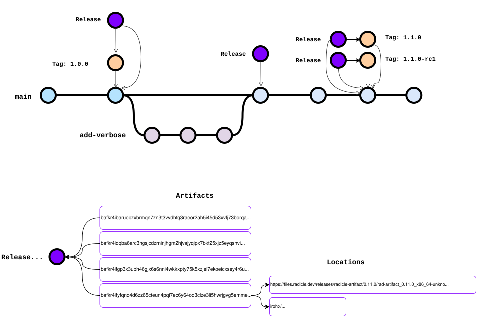

# radicle-artifact

Secure artifact distribution for [radicle](https://radicle.dev/).

Git was never built to distribute large files and binaries. Existing solutions like Git LFS encode a URL in the repository tree, which breaks Git's content-addressed nature and leaves every artifact prone to link rot.

`radicle-artifact` makes artifact distribution:

- **Verifiable and signed** — every artifact is content-addressed via a [CID] (a [BLAKE3] hash) and bound to the exact commit it was built from. Every [action](#actions) (`AddArtifact`, `Attest`, `AddLocation`, ...) is signed by its author's Ed25519 key.
- **Decentralized** — anyone can help serve artifacts, or independently rebuild and verify, increasing resilience, and making serving participatory.
- **Transport-agnostic** — artifacts can have multiple _locations_ and be shared over HTTP, iroh, IPFS, magnet links, [`rasl://`](https://dasl.ing/rasl.html), or any URL scheme. The CLI comes with [iroh-blobs](https://docs.iroh.computer/protocols/blobs) support for reliable peer-to-peer serving and fetching of artifacts with incremental verification.

Trust is multi-party and follows the repository's **delegates** — the maintainers who establish canonical branches and tags.

radicle-artifact is useful for distributing any data related to code: binaries, static sites, model weights, and scientific datasets.

## Installation

Install a prebuilt binary:

```
curl -sSf https://files.radicle.dev/releases/radicle-artifact/install | sh
```

Or build from source via crates.io:

```
cargo install radicle-artifact
```

> **Note:** radicle-artifact requires radicle installed.

## Workflow

1. **Tag** — Create a release tag or commit — ideally a [canonical reference](https://radicle.dev/2025/08/12/canonical-references).
2. **Build** — Build your release artifacts.
3. **Add** — Add artifacts to a release using the `rad-artifact add <PATH>` command, which creates the release if it doesn't exist and records the artifact CID.
4. **Seed** — Upload artifacts to an HTTP server and register the location with `rad-artifact location add`, or serve directly over iroh-blobs by starting the local seeder node (`rad-artifact node start`) and seeding the file (`rad-artifact seed <PATH>`).
5. **Fetch** — Fetch artifacts using the `rad-artifact fetch` command.
6. **Attest** — Other delegates check out the release version, build the artifacts independently and attest the CIDs match.
7. **Redact** — If an artifact is found to be compromised or fails reproducibility checks, redact it with a reason.


## How it works

> **Note:** this COB is still in early development and the API is subject to change. Feedback and contributions are very welcome!

A **Release** is a radicle [COB] (Collaborative Object) identified by a Release ID associated with a Git commit and optionally an annotated tag.

Releases contain one or more **Artifacts**, each identified by a content identifier (CID) and a name string. Each artifact tracks the DID that originally added it (the artifact author), and only that DID can update the artifact's name. Users can help mirror artifacts by announcing location URLs for any artifact, enabling decentralized mirroring.



Users can also **attest** to an artifact, recording that they independently verified the CID matches a build from the same commit. Users can also **redact** an artifact, signaling that it should not be used (e.g. due to a supply chain compromise or build reproducibility failure). Redaction is permanent: it supersedes any prior attestation from the same DID and prevents that DID from attesting again.

The artifact author and repository delegates can attach free-form **metadata** entries to an artifact, e.g. a build-environment note or an SBOM URL. Keys are strings; values are arbitrary JSON. The keyspace is shared (last-writer-wins). Per-entry attribution is not stored on the entry itself, but every write is a signed COB op, so the writer's DID is recoverable from the log.

Each user is identified by a DID that is currently mapped 1:1 to the Radicle NodeID, an Ed25519 public key. This could change in the future — there are ongoing discussions to decouple DIDs from NodeIDs as part of a broader effort to support multiple devices and agents, but for now the two are practically equivalent.

This COB is **build-system agnostic**. It works with any toolchain or build process that produces addressable artifacts. Ideally your builds are deterministic (reproducible), which lets other delegates independently verify artifacts and record attestations. However, deterministic builds are not a requirement; you can use radicle-artifact purely for publishing and discovering release artifacts without attestation.

## Data model

```
Release
├── id: Oid                           # release ID
├── oid: Oid                          # git commit ID the release is linked to
├── tag: Option<Oid>                  # optional annotated tag OID linked to the commit
├── creator: Did                      # user that created the release
└── artifacts: Map<CID, Artifact>
    └── Artifact
        ├── author: Did               # user that added this artifact
        ├── name: String              # human-readable description (only author can update)
        ├── locations: Map<Did, Set<Url>>
        ├── attestations: Set<Did>      # users that verified the CID
        ├── redactions: Map<Did, String> # users that flagged the artifact, with reason
        └── metadata: Map<String, JsonValue> # free-form annotations (author/delegate writes)
```

- **Cid** — a string newtype for any content-addressing scheme (CIDv1, sha256, etc.)
- **Locations** — plain URLs (`https://`, `ipfs://`, `magnet://`, [`rasl://`](https://dasl.ing/rasl.html), `radiroh://`, etc.)
- Each user can contribute multiple URLs per artifact; duplicate URLs are deduplicated automatically

## Collaboration and trust model

All actions on a release are signed by the acting user's DID. Most actions: creating a release, adding an artifact, attesting, redacting, registering a location, are open to any user. The exceptions are renaming an artifact (constrained to the artifact's original author) and writing metadata (constrained to the artifact's author or a repository delegate).

Trust is inherited from the repository's delegate set. By default, commands consider only releases and artifacts authored by a delegate or by the local user. Contributions from other users are hidden. Pass `--all-authors` to widen the view. Targeting a specific release with `--release <id>` always works regardless of who authored it.

## Artifact types

radicle-artifact supports two artifact types: blobs and collections, both encoded as a [CID].

| Kind       | CID [multicodec]          | Hash              | Contents                           | Transports       |
| ---------- | ------------------------- | ----------------- | ---------------------------------- | ---------------- |
| Blob       | `raw` (`0x55`)            | `blake3` (`0x1e`) | a single file                      | HTTP, iroh-blobs |
| Collection | `blake3-hashseq` (`0x80`) | `blake3` (`0x1e`) | a collection of files, i.e. folder | iroh-blobs only  |

Blobs are the common case: one binary, archive, or model file. [Collections](https://docs.iroh.computer/protocols/blobs#collections) derive a hash from a collection of files, i.e. directory, and are useful when the collection represents a single artifact, e.g. static frontend builds.

Other URL schemes (`ipfs://`, `magnet://`, `rasl://`, …) can be recorded as locations and resolved by external tools, but the CLI itself only fetches HTTP and iroh.

## Actions

| Action           | Description                                                                  |
| ---------------- | ---------------------------------------------------------------------------- |
| `Create`         | Initialize a release for a git OID (internal, auto-created by `AddArtifact`) |
| `AddArtifact`    | Add an artifact (CID + name), or update name if author re-sends              |
| `AddLocation`    | Announce a discovery URL for an artifact                                     |
| `RemoveLocation` | Retract a previously announced URL                                           |
| `Attest`         | Record independent verification of a CID                                     |
| `Redact`         | Flag an artifact as compromised/withdrawn                                    |
| `SetMetadata`    | Attach a free-form key/value entry (author/delegate only)                    |
| `RemoveMetadata` | Remove a metadata entry (author/delegate only)                               |

## COB type

`org.radworks.artifact`

## CLI usage

`<REVISION>` accepts a full OID, abbreviated hash, or tag name of a **commit or annotated tag**.

These global options apply to every command:

- `--repository <RID>` (or `-r`) targets a specific repo (defaults to cwd).
- `--no-sync` skips the network announcement after writes.
- `--no-input` disables interactive prompts (for scripts and CI).

### COB-facing commands

```
rad-artifact add <PATH> [--revision <REVISION>] [-n <NAME>]      # add artifact (creates release if needed)
rad-artifact add --cid <CID> --revision <REVISION> -n <NAME>     # register a precomputed CID without local bytes
rad-artifact location add --revision <REVISION> --cid <CID> <URL>    # add discovery URL
rad-artifact location remove --revision <REVISION> --cid <CID> <URL> # remove discovery URL
rad-artifact attest <REVISION> --cid <CID>                       # attest to an artifact
rad-artifact redact <REVISION> --cid <CID> -m <REASON>           # redact an artifact
rad-artifact metadata set --revision <REVISION> --cid <CID> [--json] <KEY> <VALUE>  # attach metadata
rad-artifact metadata unset --revision <REVISION> --cid <CID> <KEY>                 # remove metadata
rad-artifact show <REVISION> [--pretty] [--all-authors]          # show release
rad-artifact list [--pretty] [--all-authors]                     # list releases (default: delegate- or local-authored)
rad-artifact cid <PATH>                                          # compute BLAKE3 CID
rad-artifact fetch [<REVISION> --cid <CID>]                      # fetch artifact (interactive without args)
```

### Node control

```
rad-artifact node start [--foreground] [--force]                 # start the seeder daemon
rad-artifact node stop                                           # graceful shutdown
rad-artifact node status [--json]                                # endpoint id, seeded count, disk, traffic
rad-artifact node list [--json]                                  # list CIDs the node is seeding for this repo
rad-artifact node seed <PATH> [--release <ID>] [--reference] [--no-announce]  # compute CID from PATH, seed, announce
rad-artifact node unseed <CID> [--release <ID>]                  # stop seeding + retract our radiroh:// locations
rad-artifact node logs [--follow] [-n <LINES>]                   # tail <home>/artifacts/node.log
```

`rad-artifact seed` and `rad-artifact unseed` are top-level aliases for `rad-artifact node seed` / `node unseed`.

### Reconciling

```
rad-artifact reconcile [--all-repos] [--remove-orphaned <CID>] [--remove-orphaned-self]  # fix COB drift
```

## Seeding via the local node

Seeding involves running a daemon that holds a persistent iroh-blobs store that serves the files over iroh connection. Start it once and it survives shell exits and terminal closes:

```
$ rad-artifact node start
Node started (socket: /Users/you/.radicle/artifacts/control.sock)

$ rad-artifact seed ./dist/linux-amd64.tar.gz
Seeded baf...abc (12.4 MiB, new tagged)
Added radiroh location to release abc1234
```

The daemon stores blobs under `<home>/artifacts/store/` (persistent iroh-blobs FsStore), tracks what to seed via `seeded/{rid}/{cid}` tags, and writes a JSON log to `<home>/artifacts/node.log` (rotated on each start). The control socket lives at `<home>/artifacts/control.sock` (mode 0600); set `RAD_ARTIFACT_SOCKET` to override.

Log verbosity is controlled via `RUST_LOG`, which covers both this crate and iroh — e.g. `RUST_LOG=iroh_blobs=debug rad-artifact node start`. Default filter: `warn,iroh=warn,iroh_blobs=warn,radicle_artifact=info`.

The node never writes COB ops — every signed location write (`add_location`, `remove_location`) happens client-side. The daemon's identity (the iroh endpoint id) currently derives from the same Ed25519 secret as your radicle DID, so `RAD_PASSPHRASE` is required on start when the keystore is encrypted (or the parent CLI will prompt).

`rad-artifact reconcile` compares the node's seeded set to the COB locations under your DID. It auto-adds missing `radiroh://{endpoint_id}` URLs for artifacts you're seeding, and flags drift in the other direction (URLs we left behind, stale endpoint ids) without auto-removing — pass `--remove-orphaned <CID>` or `--remove-orphaned-self` explicitly when you want it gone. It also reports **dangling tags** — CIDs the node is seeding that no release references at all (so no location can anchor to them); reclaim them with `rad-artifact unseed <CID>`.

### `radiroh://` location format

Seeded artifacts are announced as `radiroh://<endpoint-id>` URLs, where `<endpoint-id>` is the iroh endpoint id encoded as **lowercase base32 with no padding** (RFC 4648, `a-z` and `2-7`). See [docs/uri-scheme.md](docs/uri-scheme.md) for the full grammar.

A bare `radiroh://` (no host) derives the endpoint id from the location author's DID, since the radicle and iroh identities share the same Ed25519 key.

#### Upgrading from `iroh://`

The scheme was renamed from the unowned `iroh://` to the Radicle-namespaced `radiroh://` ([rad issue](https://radicle.network) b93d542). Legacy `iroh://` URLs are **no longer read** — fetch ignores them. If an earlier build wrote `iroh://` locations under your DID, sweep them with `rad-artifact reconcile --remove-orphaned-self`; a follow-up `rad-artifact reconcile` re-adds fresh `radiroh://` URLs for everything you're still seeding.

## How the COB is implemented

The COB is implemented using the [`radicle`](https://crates.io/crates/radicle) crate's COB framework.

The `Release` type implements three traits that plug into the framework:

- **`CobWithType`** — registers the type name `org.radworks.artifact`
- **`Cob`** — defines how to build initial state from the first operation (`from_root`) and how to apply subsequent operations (`op`)
- **`Evaluate`** — deserializes git entries into typed operations and feeds them through the state machine

Each mutation (create, add artifact, attest, redact, etc.) is an `Action` that implements `CobAction`. Actions are written to git as signed entries via `Transaction`, and state is reconstructed on read by replaying the operation DAG.

| What the COB does                              | Module                | Key types                                             |
| ---------------------------------------------- | --------------------- | ----------------------------------------------------- |
| Define and evaluate the state machine          | `radicle::cob`        | `Evaluate`, `Op`, `Entry`                             |
| Persist and transact operations as git objects | `radicle::cob::store` | `Store`, `Transaction`, `Cob`, `CobAction`            |
| Read from and write to the git repository      | `radicle::storage`    | `ReadRepository`, `WriteRepository`, `SignRepository` |
| Sign entries with the user's Ed25519 key       | `radicle::crypto`     | `Signer`, `Signature`, `Device`                       |
| Announce changes to the network                | `radicle::node`       | `Node`, `Announcer`                                   |

## Cutting a release

See [RELEASE.md](./RELEASE.md) for the full process — drafting the changelog,
cutting the crate release with `cargo release`, and building and uploading
cross-platform binaries alongside the install script.

## License

MIT OR Apache-2.0

[COB]: https://radicle.dev/guides/protocol#collaborative-objects
[CID]: https://dasl.ing/cid.html
[multicodec]: https://github.com/multiformats/multicodec
[BLAKE3]: https://github.com/BLAKE3-team/BLAKE3
